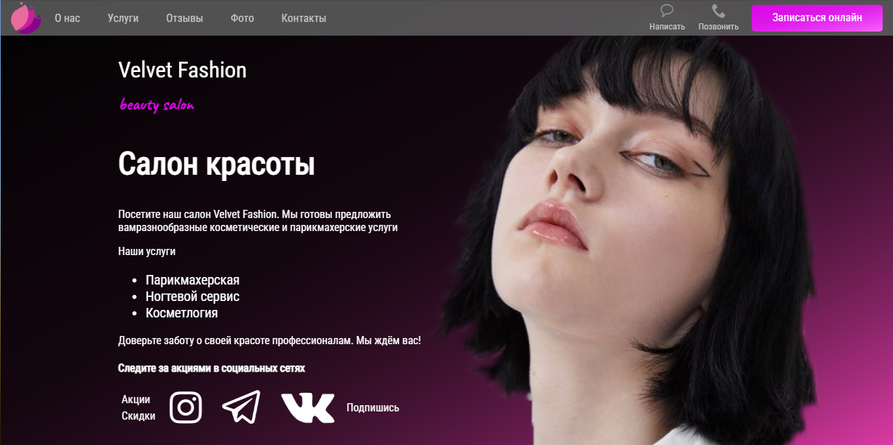

# Velvet Fashion

Сайт для салона красоты. Необычный дизайн, а также версия для мобильных устройств 




## Инструкция по запуску

1. Установите Python, Node.js и npm, если они еще не установлены на вашем компьютере.
2. Склонируйте репозиторий на свой компьютер.
3. Перейдите в папку проекта.
4. Установите зависимости для Django:
   
   ```
   pip install -r requirements.txt
   ```

5. Установите зависимости для React:
   
   ```
   npm install
   ```

6. Запустите Django сервер:
   
   ```
   python manage.py runserver
   ```

7.  Откройте браузер и перейдите на http://localhost:8000/ чтобы увидеть сайт.

## Технологии

- Django
- React